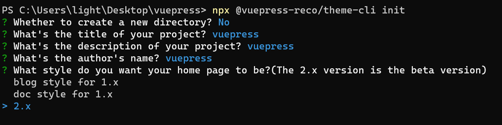
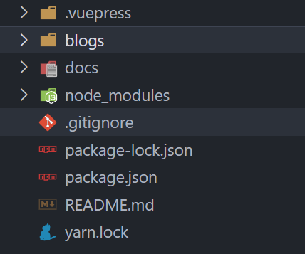
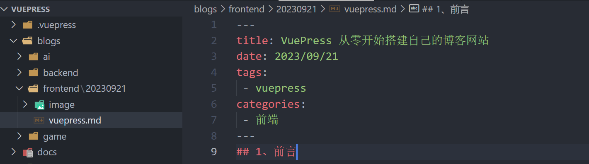
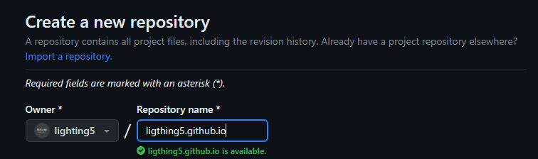
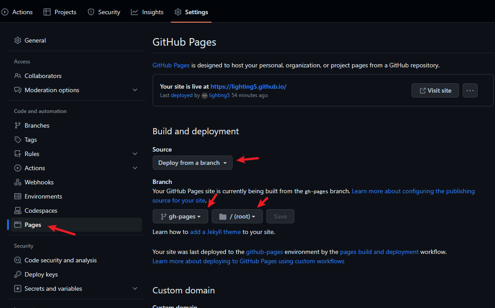

## 1、前言

俗话说的好：好记性不如烂笔头。做技术的，有自己的一个博客网站，不仅可以记录自己的学习笔记，分享自己的技术文章，还可以和志同道合的开发者交流，何乐而不为呢？
那么如何简单高效diy一个自己的博客网站呢？VuePress 就是一款非常优秀的静态网站生成器，它基于 Vue 构建，以 Markdown 为中心的项目结构，以最少的配置帮助你专注于写作。
简单来说，只要你配置好项目后，就可以直接写Markdown文档，然后生成静态网站，部署到Github、Gitee、Coding等静态网站托管平台，就可以直接访问了。

## 2、技术选型

[这个是VuePress的官方文档](https://v2.vuepress.vuejs.org/zh/guide/)，有兴趣深挖VuePress配置信息的同学可以过一遍文档。官方也给出了选择VuePress，而不是Nuxt、VitePress、GitBook等其他工具的理由。
另外，如果是使用VuePress的默认主题的话，可能还是会让博客看起来比较单调，所以这里推荐使用[vuepress-theme-reco](https://vuepress-theme-reco.recoluan.com/)，一个基于 VuePress 2.x 的主题，这个主题插件看起来还是挺好看的，今天就以这个主题为例，来手把手教大家如何搭建一个属于自己的博客网站。

## 3、安装配置

### 快速开始

安装vuepress-theme-reco，官方给出了三种方式：

**npx**

```bash
# 初始化，并选择 2.x
npx @vuepress-reco/theme-cli init
```

**npm**

```bash
# 初始化，并选择 2.x
npm install @vuepress-reco/theme-cli@1.0.7 -g
theme-cli init
```

**yarn**

```bash
# 初始化，并选择 2.x
yarn global add @vuepress-reco/theme-cli@1.0.7
theme-cli init
```

这里我选择第一种方式
1. 先新建一个文件夹命名vuepress。
   
2. 进入vuepress文件夹，执行命令`npx @vuepress-reco/theme-cli init` 选择2.x版本。



3. 用vscode打开项目,`npm install`安装依赖，然后`npm run dev`启动项目，可以看到，项目是用vite来构建的。


   
### 自定义配置

项目的文件目录如下：


- .vuepress 是vuepress的配置目录
- blogs 是放置博客目录
- docs 是放置文档目录

**README.md是首页,这边可以修改成自己的信息**

```md{10-21}
---
home: true
modules:
  - BannerBrand
  - Blog
  - MdContent
  - Footer
bannerBrand:
  bgImage: '/bg.svg'
  title: 码无止境の世界
  description: Code is Life
  tagline: 在无止境的编程代码世界里遨游，用代码改变我们的生活。
  buttons:
    - { text: 进入, link: '/categories/qianduan/1/' }
    - { text: 公众号, link: '/docs/wechat', type: plain }
  socialLinks:
    - { icon: LogoGithub , link: 'https://github.com/lighting5' }
blog:
  socialLinks:
    - { icon: LogoGithub , link: 'https://github.com/lighting5' }
    - { icon: LogoWechat , link: '/docs/wechat' }
isShowTitleInHome: true
actionText: About
actionLink: /views/other/about
---
```
首页效果如下：


config.ts配置修改
```js{15-18}
import { defineUserConfig } from "vuepress";
import recoTheme from "vuepress-theme-reco";

export default defineUserConfig({
  title: "码无止境 Code is Life",
  description: "在无止境的编程代码世界里遨游，用代码改变我们的生活",
  theme: recoTheme({
    style: "@vuepress-reco/style-default",
    logo: "/logo.png",
    author: "码无止境",
    authorAvatar: "/logo.png",
    lastUpdatedText: "",
    navbar: [
      { text: "首页", link: "/" },
      { text: "前端", link: "/categories/qianduan/1/" },
      // { text: "后端", link: "/categories/houduan/1/" },
      // { text: "游戏", link: "/categories/youxi/1/" },
      { text: "工具", link: "/categories/tools/1/" },
    ],
  }),
});


```
**开始写文章啦~~**
1. 首先在blogs目录下创建你自己分类的文件夹
   
   

2. 我这边按类别向下按日期分类文章
   
   

   

::: tip
文章中用到的图片，只需要截图后粘贴进markdown文档中，会自动将图片放置到同级目录的image文件夹下。
另外，在vscode中写markdown文档，用下面这些vscode扩展就可以了。

   

:::


3. 每篇文章的开头都是以---和---包裹的文章头，其中tags定义好后，vuepress会自动根据你的tag进行文章标签分类，categories则会根据类别整理文章。
   >这边如果分类名称是中文的话，在config.ts中定义link时候就是按照中文拼音来定义的，可以看上面的config代码块中的高亮代码部分 :point_up:

文章分类页面如下


至于怎么写好Markdown文档，可以参考[VuePress官网关于Markdown的介绍](https://v2.vuepress.vuejs.org/zh/guide/markdown.html)


## 4、部署上线
基本上我们的博客已经搭建完成了，接下来就是部署上线了，可以使用Github Pages，免费让我们的博客上线。

1. 首先，在Github上创建一个仓库，仓库名用你的用户名+github.io: `<USERNAME>.github.io`
   
  
  
  ::: tip
   如果你访问github很慢的话，可以参考这里 [Github访问速度太慢？一个小工具就够了！](/blogs/tools/20230923)
  :::

2. 然后，将你的仓库克隆到本地，再将你的vuepress项目拷贝到仓库根目录下，然后将仓库推送到github的master主分支上，另外还需要创建另一个分支用来发布博客静态页面`gh-pages`。

3. 在Github仓库的设置Settings中找到Pages，修改相应配置后，点击Save。
   
   

4. 在你的项目根目录下新建deploy.sh脚本，内容如下：
   
```sh
  # 确保脚本抛出遇到的错误
  set -e

  # 生成静态文件
  npm run build

  # 进入生成的文件夹
  cd .vuepress/dist


  git init
  git add -A
  git commit -m 'deploy'

  # 如果发布到 https://<USERNAME>.github.io
  # git push -f git@github.com:<USERNAME>/<USERNAME>.github.io.git master

  # 如果发布到 https://<USERNAME>.github.io/<REPO>
  git push -f https://github.com/lighting5/lighting5.github.io.git master:gh-pages

  cd -
```

5. 打开项目文件位置，右键用git bash执行deploy脚本，将本地项目推送到github的gh-pages分支，同时github的Actions会自动执行部署工作流。
   
   

```sh
#执行部署脚本
./deploy.sh
```


6. 成功部署后就可以访问你的个人博客了，访问地址就是`<USERNAME>.github.io`。
   
   我的已经成功上线了，欢迎围观！😃 [https://lighting5.github.io/](https://lighting5.github.io/)


**完结撒花 🎉🎉🎉**

::: tip

欢迎关注我的公众号`码无止境`，更多干货技术文章等你解锁！


:::