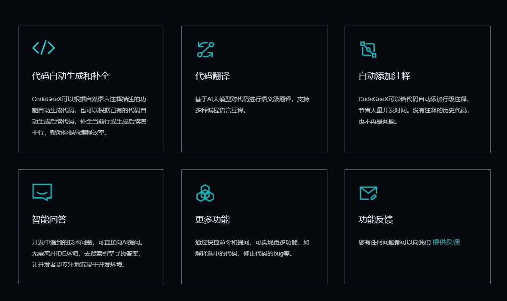
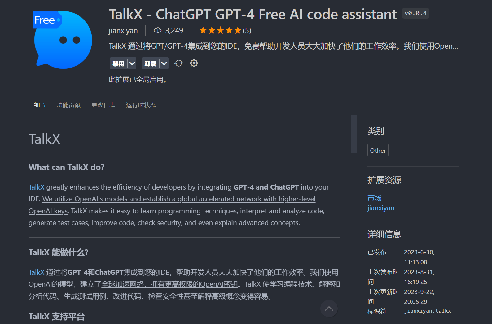

随着ChatGPT的爆火，AI大模型工具如雨后春笋般涌现，数据大模型也确实展现了其不仅仅停留于概念上的价值，在实际应用中也开始崭露头角。但是国外ChatGPT的大模型工具使用对于国内大部分人来说仍然有比较大的门槛，比如网络访问限制问题，账户注册限制，账户封号等问题。那么在国内，有没有一些可替代工具呢？答案是肯定的，下面我给大家推荐几个国内可用的AI大模型工具。

### 文心一言
   [文心一言](https://yiyan.baidu.com/)是百度AI开放平台推出的AI数据大模型工具，是国内最早一个推出数据大模型工具的。
   但是作为第一个吃螃蟹的人，可能上线比较仓促，文心一言一开始并没有像ChatGPT那样智能。其推出的AI画图功能甚至被网友们一度嘲讽，用的提示词用中文还要先去生硬地翻译成英文再进行数据生成，让人一度怀疑是不是直接套壳ChatGPT。问答功能对比ChatGPT也是差了很远。

   

   不过现阶段应该是有比较大的进步了。目前有一言百宝箱有多场景应用。

   

   还集成了插件功能，不过对比ChatGPT的插件应用市场还是差的挺多的。

   

### 讯飞星火
   [讯飞星火](https://xinghuo.xfyun.cn)是讯飞推出的AI数据大模型工具，其推出的时间比文心一言要晚一些，但是其AI问答功能相较而言却是好上了一大截。号称今年要追平GPT3.5，明年追平GPT4。

   

   目前不仅有桌面端，APP、微信小程序、H5等全端上线了应用。还支持语音对话，非常方便。
   
   

   其插件功能包括PPT生成，文档文档，简历生成等。

   

### 通义千问
   [通义千问](https://qianwen.aliyun.com/)是阿里推出的AI数据大模型工具，其推出时间比文心一言和讯飞星火都晚一些，通义千问走的是开源路线。GitHub链接：[https://github.com/QwenLM](https://github.com/QwenLM)
   
   

   其百宝袋功能也推出了一些比较实用的应用场景。阿里的钉钉也已经集成了通义千问。

   

   
对于上面提到几个AI大数据模型工具，都是免费使用的，注册起来也很简便，用手机号就可以注册了。建议大家可以同时打开，问他们同样的问题，看看谁的答案更能满足你的需求。

另外，如果你是程序员的话，还有更加实用的AI工具可以让你写代码如虎添翼，健步如飞。

**CodeGeeX**
可以实现自动代码补全，另外每天还有限量的AI问答功能，还有不同编程语言切换翻译等。

**TalkX**
通过将GPT/GPT-4集成到您的IDE，免费帮助开发人员大大加快了他们的工作效率。

**目前国内的大厂基本都在布局自己的AI数据大模型，如华为，腾讯，京东，字节，小米等都在做自己的大模型，并逐步应用到自家的产品线上。但是目前相较国外，国内的AI大模型工具还是有一段差距，相信不久的将来，中国的AI大模型肯定是会超越国外的。**